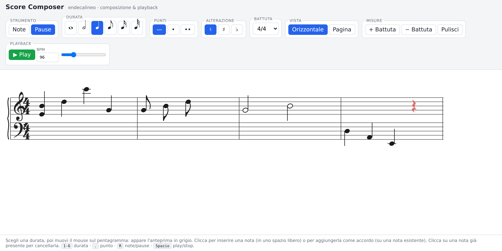

# Score Composer

Un'app **React** per **comporre e suonare** una partitura musicale su
**endecalineo** (i due pentagrammi di violino e basso uniti dal Do centrale).

> Sotto-progetto web, indipendente dall'app macOS AudioLens che vive nella
> stessa repository.



## Funzionalità

- **Endecalineo** — pentagramma di violino + pentagramma di basso, con graffa,
  chiavi, Do centrale su taglio addizionale e tagli addizionali sopra/sotto
  calcolati automaticamente.
- **Palette di inserimento**
  - Strumento: **Note** / **Pause**
  - Durata: intero, metà, quarto, ottavo, sedicesimo, trentaduesimo
  - **Punti** di valore (0, 1, 2)
  - **Alterazioni**: naturale, diesis (♯), bemolle (♭)
- **Divisione della battuta** — 2/4, 3/4, 4/4, 5/4, 6/8, 9/8, 12/8, 3/8, 2/2.
- **Inserimento a hover & click** (prima modalità del requisito):
  1. Scegli una durata dalla palette.
  2. Muovendo il mouse sulla battuta appare l'anteprima della nota **in grigio**,
     con eventuali tagli addizionali.
  3. **Click** su uno spazio libero → nuova nota singola.
  4. **Click** dove c'è già una nota (altra altezza) → **accordo** (note
     contemporanee, stessa durata).
  5. **Click** su una nota già presente → la **cancella**.
  6. Stesso comportamento per le pause.

  L'anteprima cambia colore per anticipare l'azione: grigio = inserisci,
  blu = accordo, rosso = cancella.
- **Due viste**
  - **Orizzontale**: la partitura è un unico rigo che scorre a sinistra/destra
    (anche automaticamente durante il playback).
  - **Pagina**: le battute vanno a capo in più righe/sistemi; durante il
    playback lo scorrimento è verticale.
- **Playback (Web Audio)** con **BPM** regolabile e un **cursore verticale
  evidenziato** che segue le note suonate, con auto-scroll.
- **Strumenti campionati** — accanto al Play si sceglie lo strumento (piano,
  archi, fiati, chitarre, … con relativa icona). I campioni si scaricano
  **lazy** al primo uso e la scelta è ricordata tra le sessioni; il synth
  storico dell'app resta disponibile come **"8 bit sound"**.
- **Ritornelli** — con lo strumento *Ritornello*: clic nella metà sinistra di
  una battuta per il segno di inizio `|:`, nella metà destra per quello di
  fine `:|`. Trascinando in verticale sul segno di inizio si imposta il numero
  di esecuzioni (mostrato sopra il segno se ≠ 1); sotto l'1 diventa **∞** e la
  sezione va in loop nel playback. Doppio clic su un segno per eliminarlo. Il
  playback (audio e MIDI) espande i ritornelli.

## Avvio

```bash
cd score-composer
npm install
npm run dev      # server di sviluppo (http://localhost:5173)
```

Altri comandi:

```bash
npm run build     # type-check + build di produzione in dist/
npm run preview   # anteprima della build
npm run typecheck # solo controllo dei tipi
```

## Scorciatoie da tastiera

| Tasto | Azione |
| --- | --- |
| `1`–`6` | durata (intero → trentaduesimo) |
| `.` | cicla i punti di valore |
| `R` | alterna Note / Pause |
| `Spazio` | play / stop |

## Come funziona (architettura)

```
src/
  music/
    constants.ts   geometria del rigo e risoluzione ritmica (tick)
    types.ts       modello dati (Pitch, Duration, Event, Measure, Score)
    theory.ts      altezza↔posizione diatonica, frequenze, durate in tick
    layout.ts      mappatura diatonica↔y, tagli addizionali, sistemi/battute
    placement.ts   regole crea/accordo/cancella/bloccato
    smufl.ts       code point SMuFL (Bravura) usati
    audio.ts       scheduler e player Web Audio + playhead
    instruments.ts catalogo strumenti campionati e lazy loading dei sample
  state/
    scoreReducer.ts  stato della partitura e azioni
  components/
    Toolbar.tsx    palette, battuta, vista, trasporto
    Score.tsx      contenitore, layout dei sistemi, auto-scroll del playhead
    System.tsx     un endecalineo: rigo, chiavi, battute, hover/click, playhead
    Note.tsx       testa/e, gambo, code (flag), tagli addizionali, alterazioni, punti
    Rest.tsx       pause
    InstrumentIcon.tsx  icone SVG degli strumenti del playback
  App.tsx          stato dell'interfaccia e collegamenti
```

**Modello del tempo.** Ogni battuta è lunga `numeratore × (768 / denominatore)`
tick (768 tick = semibreve). Gli eventi hanno `startTick` e durata in tick; la
posizione orizzontale è proporzionale al tick, quella verticale è la "posizione
diatonica" (ogni linea/spazio = 1 passo, Do centrale = 28).

**Rendering.** Linee del rigo, tagli addizionali, teste di nota, gambi, punti,
stanghette e playhead sono disegnati come primitive SVG; chiavi, pause,
alterazioni, code e cifre di tempo usano i glifi del font musicale **Bravura**
(SMuFL), dove 1em = 4 spazi del rigo.

## Limitazioni note / possibili sviluppi

- Niente travature (le crome/semicrome hanno code singole), né gruppi
  irregolari (terzine).
- Niente armatura di chiave; le alterazioni sono per singola nota.
- Le note contemporanee sono modellate come accordi (stessa durata), non come
  voci indipendenti.
- Salvataggio/caricamento e export MIDI/MusicXML non ancora presenti
  (il reducer prevede già un'azione `LOAD`).

## Licenze

- Codice: vedi la licenza della repository (GPL-3.0-or-later).
- Font **Bravura** (`src/assets/Bravura.woff`) — SIL Open Font License 1.1,
  © Steinberg Media Technologies GmbH. Testo in `src/assets/Bravura-OFL.txt`.
- Campioni degli strumenti da
  [nbrosowsky/tonejs-instruments](https://github.com/nbrosowsky/tonejs-instruments)
  — Creative Commons Attribution 3.0 (CC-BY 3.0) — e
  **Salamander Grand Piano** di Alexander Holm (CC-BY 3.0), serviti via
  [tonejs.github.io](https://tonejs.github.io/).
